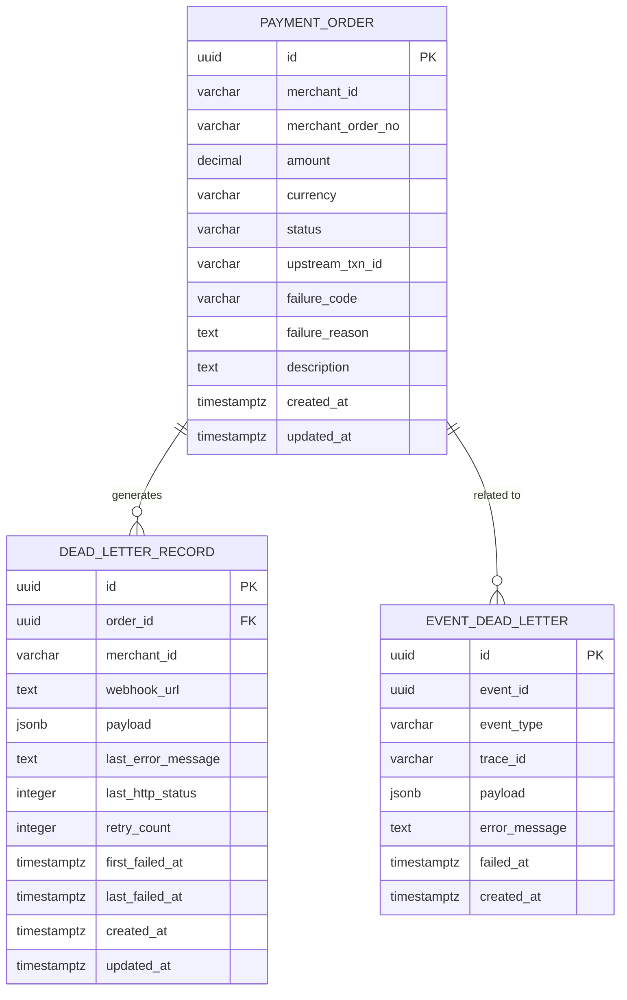
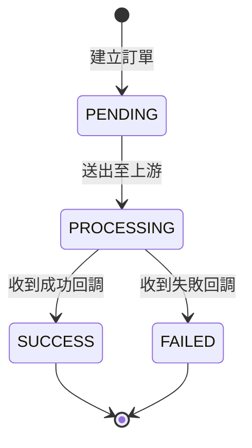

# Data Model: 最小代收交易流

**Feature**: `001-minimal-payment-flow` | **Date**: 2025-12-05

本文件定義資料模型，包含 PostgreSQL Schema、實體關係與 TypeScript 類型定義。

---

## Entity Relationship Diagram



---

## PostgreSQL Schema

### 資料表：payment_orders

代表一筆代收交易訂單。

```sql
CREATE TYPE order_status AS ENUM ('PENDING', 'PROCESSING', 'SUCCESS', 'FAILED');

CREATE TABLE payment_orders (
    id UUID PRIMARY KEY DEFAULT gen_random_uuid(),
    merchant_id VARCHAR(50) NOT NULL,
    merchant_order_no VARCHAR(100) NOT NULL,
    amount DECIMAL(18, 4) NOT NULL CHECK (amount > 0),
    currency VARCHAR(3) NOT NULL,
    status order_status NOT NULL DEFAULT 'PENDING',
    upstream_txn_id VARCHAR(100),
    failure_code VARCHAR(50),
    failure_reason TEXT,
    description TEXT,
    created_at TIMESTAMPTZ NOT NULL DEFAULT NOW(),
    updated_at TIMESTAMPTZ NOT NULL DEFAULT NOW(),

    -- 唯一約束：同一商戶的訂單編號不可重複
    CONSTRAINT uq_merchant_order UNIQUE (merchant_id, merchant_order_no)
);

-- 查詢索引
CREATE INDEX idx_payment_orders_status ON payment_orders (status);
CREATE INDEX idx_payment_orders_merchant_id ON payment_orders (merchant_id);
CREATE INDEX idx_payment_orders_created_at ON payment_orders (created_at DESC);
CREATE INDEX idx_payment_orders_status_created ON payment_orders (status, created_at);
```

### 資料表：dead_letter_records

記錄 Webhook 通知失敗的訂單。

```sql
CREATE TABLE dead_letter_records (
    id UUID PRIMARY KEY DEFAULT gen_random_uuid(),
    order_id UUID NOT NULL REFERENCES payment_orders(id),
    merchant_id VARCHAR(50) NOT NULL,
    webhook_url TEXT NOT NULL,
    payload JSONB NOT NULL,
    last_error_message TEXT NOT NULL,
    last_http_status INTEGER,
    retry_count INTEGER NOT NULL DEFAULT 0,
    first_failed_at TIMESTAMPTZ NOT NULL DEFAULT NOW(),
    last_failed_at TIMESTAMPTZ NOT NULL DEFAULT NOW(),
    created_at TIMESTAMPTZ NOT NULL DEFAULT NOW(),
    updated_at TIMESTAMPTZ NOT NULL DEFAULT NOW()
);

-- 查詢索引
CREATE INDEX idx_dead_letter_order_id ON dead_letter_records (order_id);
CREATE INDEX idx_dead_letter_merchant_id ON dead_letter_records (merchant_id);
CREATE INDEX idx_dead_letter_last_failed ON dead_letter_records (last_failed_at DESC);
```

### 資料表：event_dead_letters

記錄事件處理失敗的死信。

```sql
CREATE TABLE event_dead_letters (
    id UUID PRIMARY KEY DEFAULT gen_random_uuid(),
    event_id UUID NOT NULL,
    event_type VARCHAR(50) NOT NULL,
    trace_id VARCHAR(100),
    payload JSONB NOT NULL,
    error_message TEXT NOT NULL,
    failed_at TIMESTAMPTZ NOT NULL DEFAULT NOW(),
    created_at TIMESTAMPTZ NOT NULL DEFAULT NOW()
);

-- 查詢索引
CREATE INDEX idx_event_dead_letter_type ON event_dead_letters (event_type);
CREATE INDEX idx_event_dead_letter_failed ON event_dead_letters (failed_at DESC);
CREATE INDEX idx_event_dead_letter_event_id ON event_dead_letters (event_id);
```

---

## TypeScript 類型定義

### PaymentOrder

```typescript
// shared/domain/payment-order.ts

export const OrderStatus = {
  PENDING: 'PENDING',
  PROCESSING: 'PROCESSING',
  SUCCESS: 'SUCCESS',
  FAILED: 'FAILED',
} as const;

export type OrderStatus = typeof OrderStatus[keyof typeof OrderStatus];

export interface PaymentOrder {
  id: string;                    // UUID
  merchantId: string;
  merchantOrderNo: string;
  amount: string;                // Decimal as string for precision
  currency: string;              // ISO-4217
  status: OrderStatus;
  upstreamTxnId?: string;
  failureCode?: string;
  failureReason?: string;
  description?: string;
  createdAt: Date;
  updatedAt: Date;
}

export interface CreateOrderInput {
  merchantId: string;
  merchantOrderNo: string;
  amount: string;
  currency: string;
  description?: string;
}

export interface UpdateOrderStatusInput {
  orderId: string;
  newStatus: OrderStatus;
  upstreamTxnId?: string;
  failureCode?: string;
  failureReason?: string;
}
```

### DeadLetterRecord

```typescript
// shared/domain/dead-letter.ts

export interface DeadLetterRecord {
  id: string;                    // UUID
  orderId: string;
  merchantId: string;
  webhookUrl: string;
  payload: WebhookPayload;
  lastErrorMessage: string;
  lastHttpStatus?: number;
  retryCount: number;
  firstFailedAt: Date;
  lastFailedAt: Date;
  createdAt: Date;
  updatedAt: Date;
}

export interface WebhookPayload {
  orderId: string;
  merchantOrderNo: string;
  status: string;
  amount: string;
  currency: string;
  failureCode?: string;
  failureReason?: string;
  updatedAt: string;
}

export interface CreateDeadLetterInput {
  orderId: string;
  merchantId: string;
  webhookUrl: string;
  payload: WebhookPayload;
  lastErrorMessage: string;
  lastHttpStatus?: number;
  retryCount: number;
}
```

### EventDeadLetter

```typescript
// shared/domain/event-dead-letter.ts

export interface EventDeadLetter {
  id: string;                    // UUID
  eventId: string;
  eventType: string;
  traceId?: string;
  payload: unknown;
  errorMessage: string;
  failedAt: Date;
  createdAt: Date;
}

export interface CreateEventDeadLetterInput {
  eventId: string;
  eventType: string;
  traceId?: string;
  payload: unknown;
  errorMessage: string;
}
```

---

## 事件模型

### 共用欄位

```typescript
// shared/events/types.ts

export interface BaseEvent<T = unknown> {
  eventId: string;               // UUID
  eventType: string;
  occurredAt: string;            // ISO 8601
  traceId: string;
  payload: T;
}
```

### OrderCreated 事件

```typescript
// shared/events/order-created.ts

export interface OrderCreatedPayload {
  orderId: string;
  merchantId: string;
  amount: string;
  currency: string;
  initialStatus: 'PENDING';
}

export type OrderCreatedEvent = BaseEvent<OrderCreatedPayload>;

export function createOrderCreatedEvent(
  order: PaymentOrder,
  traceId: string
): OrderCreatedEvent {
  return {
    eventId: crypto.randomUUID(),
    eventType: 'OrderCreated',
    occurredAt: new Date().toISOString(),
    traceId,
    payload: {
      orderId: order.id,
      merchantId: order.merchantId,
      amount: order.amount,
      currency: order.currency,
      initialStatus: 'PENDING',
    },
  };
}
```

### OrderStatusChanged 事件

```typescript
// shared/events/order-status-changed.ts

export interface OrderStatusChangedPayload {
  orderId: string;
  merchantId: string;
  oldStatus: OrderStatus;
  newStatus: OrderStatus;
  failureCode?: string;
  failureReason?: string;
}

export type OrderStatusChangedEvent = BaseEvent<OrderStatusChangedPayload>;

export function createOrderStatusChangedEvent(
  order: PaymentOrder,
  oldStatus: OrderStatus,
  traceId: string
): OrderStatusChangedEvent {
  return {
    eventId: crypto.randomUUID(),
    eventType: 'OrderStatusChanged',
    occurredAt: new Date().toISOString(),
    traceId,
    payload: {
      orderId: order.id,
      merchantId: order.merchantId,
      oldStatus,
      newStatus: order.status,
      failureCode: order.failureCode,
      failureReason: order.failureReason,
    },
  };
}
```

---

## 狀態機

### 訂單狀態轉換

```typescript
// shared/domain/payment-order.ts

export const VALID_TRANSITIONS: Record<OrderStatus, OrderStatus[]> = {
  PENDING: ['PROCESSING'],
  PROCESSING: ['SUCCESS', 'FAILED'],
  SUCCESS: [],      // 終態
  FAILED: [],       // 終態
};

export function canTransition(from: OrderStatus, to: OrderStatus): boolean {
  return VALID_TRANSITIONS[from].includes(to);
}

export function isTerminalStatus(status: OrderStatus): boolean {
  return status === 'SUCCESS' || status === 'FAILED';
}

export class InvalidStatusTransitionError extends Error {
  constructor(from: OrderStatus, to: OrderStatus) {
    super(`Invalid status transition: ${from} → ${to}`);
    this.name = 'InvalidStatusTransitionError';
  }
}
```

### 狀態轉換圖



---

## 驗證規則

### PaymentOrder 驗證

```typescript
// shared/http/validation.ts

import { z } from 'zod';

export const CreateOrderSchema = z.object({
  merchantOrderNo: z.string().min(1).max(100),
  amount: z.string().regex(/^\d+(\.\d{1,4})?$/, 'Invalid amount format'),
  currency: z.string().length(3).regex(/^[A-Z]{3}$/, 'Invalid currency format'),
  description: z.string().max(500).optional(),
});

export type CreateOrderRequest = z.infer<typeof CreateOrderSchema>;

export const CallbackSchema = z.object({
  orderId: z.string().uuid(),
  result: z.enum(['SUCCESS', 'FAILED']),
  upstreamTxnId: z.string().min(1),
  failureCode: z.string().optional(),
  failureMessage: z.string().optional(),
});

export type CallbackRequest = z.infer<typeof CallbackSchema>;
```

### 金額驗證

- 必須為正數
- 最多 4 位小數
- 最大值：999,999,999,999.9999（配合 DECIMAL(18,4)）

### 幣別驗證

- 必須為 ISO-4217 格式
- 本階段僅支援：TWD、USD

---

## Repository 介面

### PaymentOrderRepository

```typescript
// shared/db/repositories/payment-order.ts

export interface PaymentOrderRepository {
  /**
   * 建立訂單（冪等）
   * @returns 新建立或既有的訂單
   * @throws IdempotencyConflictError 若內容不一致
   */
  createOrReturn(input: CreateOrderInput): Promise<PaymentOrder>;

  /**
   * 條件式更新狀態（CAS）
   * @returns 更新後的訂單，若條件不符則回傳 null
   */
  updateStatusIfMatch(
    orderId: string,
    expectedStatus: OrderStatus,
    newStatus: OrderStatus,
    additionalFields?: Partial<PaymentOrder>
  ): Promise<PaymentOrder | null>;

  /**
   * 依 ID 查詢訂單
   */
  findById(orderId: string): Promise<PaymentOrder | null>;

  /**
   * 依商戶訂單編號查詢
   */
  findByMerchantOrderNo(
    merchantId: string,
    merchantOrderNo: string
  ): Promise<PaymentOrder | null>;
}
```

### DeadLetterRepository

```typescript
// shared/db/repositories/dead-letter.ts

export interface DeadLetterRepository {
  /**
   * 建立死信記錄
   */
  create(input: CreateDeadLetterInput): Promise<DeadLetterRecord>;

  /**
   * 依訂單 ID 查詢
   */
  findByOrderId(orderId: string): Promise<DeadLetterRecord | null>;

  /**
   * 分頁查詢（供手動處理用）
   */
  listRecent(limit: number, offset: number): Promise<DeadLetterRecord[]>;
}
```

---

## Migration 檔案

### 001_initial_schema.sql

```sql
-- Migration: 001_initial_schema
-- Created: 2025-12-05
-- Description: 建立初始資料表結構

BEGIN;

-- 訂單狀態 ENUM
CREATE TYPE order_status AS ENUM ('PENDING', 'PROCESSING', 'SUCCESS', 'FAILED');

-- 主表：payment_orders
CREATE TABLE payment_orders (
    id UUID PRIMARY KEY DEFAULT gen_random_uuid(),
    merchant_id VARCHAR(50) NOT NULL,
    merchant_order_no VARCHAR(100) NOT NULL,
    amount DECIMAL(18, 4) NOT NULL CHECK (amount > 0),
    currency VARCHAR(3) NOT NULL,
    status order_status NOT NULL DEFAULT 'PENDING',
    upstream_txn_id VARCHAR(100),
    failure_code VARCHAR(50),
    failure_reason TEXT,
    description TEXT,
    created_at TIMESTAMPTZ NOT NULL DEFAULT NOW(),
    updated_at TIMESTAMPTZ NOT NULL DEFAULT NOW(),
    CONSTRAINT uq_merchant_order UNIQUE (merchant_id, merchant_order_no)
);

CREATE INDEX idx_payment_orders_status ON payment_orders (status);
CREATE INDEX idx_payment_orders_merchant_id ON payment_orders (merchant_id);
CREATE INDEX idx_payment_orders_created_at ON payment_orders (created_at DESC);
CREATE INDEX idx_payment_orders_status_created ON payment_orders (status, created_at);

-- Webhook 死信表
CREATE TABLE dead_letter_records (
    id UUID PRIMARY KEY DEFAULT gen_random_uuid(),
    order_id UUID NOT NULL REFERENCES payment_orders(id),
    merchant_id VARCHAR(50) NOT NULL,
    webhook_url TEXT NOT NULL,
    payload JSONB NOT NULL,
    last_error_message TEXT NOT NULL,
    last_http_status INTEGER,
    retry_count INTEGER NOT NULL DEFAULT 0,
    first_failed_at TIMESTAMPTZ NOT NULL DEFAULT NOW(),
    last_failed_at TIMESTAMPTZ NOT NULL DEFAULT NOW(),
    created_at TIMESTAMPTZ NOT NULL DEFAULT NOW(),
    updated_at TIMESTAMPTZ NOT NULL DEFAULT NOW()
);

CREATE INDEX idx_dead_letter_order_id ON dead_letter_records (order_id);
CREATE INDEX idx_dead_letter_merchant_id ON dead_letter_records (merchant_id);
CREATE INDEX idx_dead_letter_last_failed ON dead_letter_records (last_failed_at DESC);

-- 事件死信表
CREATE TABLE event_dead_letters (
    id UUID PRIMARY KEY DEFAULT gen_random_uuid(),
    event_id UUID NOT NULL,
    event_type VARCHAR(50) NOT NULL,
    trace_id VARCHAR(100),
    payload JSONB NOT NULL,
    error_message TEXT NOT NULL,
    failed_at TIMESTAMPTZ NOT NULL DEFAULT NOW(),
    created_at TIMESTAMPTZ NOT NULL DEFAULT NOW()
);

CREATE INDEX idx_event_dead_letter_type ON event_dead_letters (event_type);
CREATE INDEX idx_event_dead_letter_failed ON event_dead_letters (failed_at DESC);
CREATE INDEX idx_event_dead_letter_event_id ON event_dead_letters (event_id);

-- updated_at 自動更新觸發器
CREATE OR REPLACE FUNCTION update_updated_at_column()
RETURNS TRIGGER AS $$
BEGIN
    NEW.updated_at = NOW();
    RETURN NEW;
END;
$$ language 'plpgsql';

CREATE TRIGGER update_payment_orders_updated_at
    BEFORE UPDATE ON payment_orders
    FOR EACH ROW
    EXECUTE FUNCTION update_updated_at_column();

CREATE TRIGGER update_dead_letter_records_updated_at
    BEFORE UPDATE ON dead_letter_records
    FOR EACH ROW
    EXECUTE FUNCTION update_updated_at_column();

COMMIT;
```
