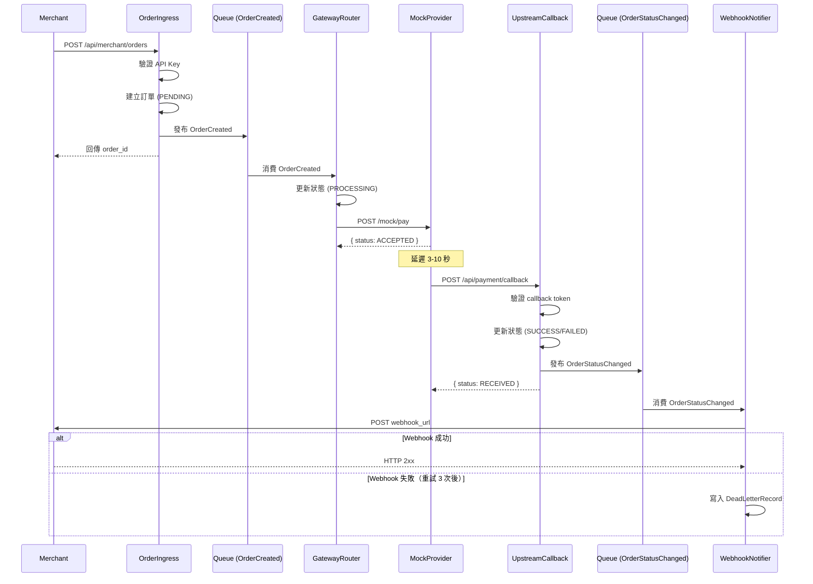

# Feature Specification: 最小代收交易流

**Feature Branch**: `001-minimal-payment-flow`
**Created**: 2025-12-05
**Status**: Ready for Implementation
**Input**: 建立單一商戶代收交易流的最小垂直切片

## User Scenarios & Testing *(mandatory)*

### User Story 1 - 商戶下單建立交易 (Priority: P1)

商戶透過 API 發起一筆代收交易請求，系統建立訂單並回傳平台訂單編號，訂單狀態為「待處理」。

**Why this priority**: 這是整個交易流的入口點，沒有訂單建立就無法進行後續所有流程。此功能獨立運作即可驗證 API 入口與資料儲存是否正常。

**Independent Test**: 透過 HTTP 呼叫下單 API 並驗證回傳的訂單編號與狀態，即可確認此功能完整運作。

**Acceptance Scenarios**:

1. **Given** 商戶擁有有效的 API 金鑰，**When** 商戶發送包含金額、幣別、商戶訂單編號的下單請求，**Then** 系統回傳平台訂單編號，訂單狀態為 `PENDING`
2. **Given** 商戶發送的請求缺少必要欄位（如金額），**When** 系統收到請求，**Then** 系統回傳錯誤訊息說明缺少哪些必要欄位
3. **Given** 商戶使用無效的 API 金鑰，**When** 發送下單請求，**Then** 系統回傳驗證失敗錯誤

---

### User Story 2 - 交易路由至上游並取得結果 (Priority: P2)

訂單建立後，系統自動將交易轉發至金流上游（模擬），並取得交易結果更新訂單狀態。

**Why this priority**: 這是交易流程的核心處理邏輯，必須在訂單建立（P1）完成後才能進行。此功能展示事件驅動與外部服務呼叫的整合。

**Independent Test**: 建立訂單後，驗證訂單狀態從 `PENDING` 變為 `PROCESSING`，最終變為 `SUCCESS` 或 `FAILED`。

**Acceptance Scenarios**:

1. **Given** 一筆狀態為 `PENDING` 的訂單，**When** 系統消費訂單建立事件，**Then** 系統呼叫上游服務並將訂單狀態更新為 `PROCESSING`
2. **Given** 上游服務回傳成功結果，**When** 系統收到回調，**Then** 訂單狀態更新為 `SUCCESS`
3. **Given** 上游服務回傳失敗結果，**When** 系統收到回調，**Then** 訂單狀態更新為 `FAILED`

---

### User Story 3 - 通知商戶交易結果 (Priority: P3)

交易狀態確定後，系統透過 Webhook 通知商戶最終結果。

**Why this priority**: 商戶需要知道交易結果以便更新自己的訂單系統。此功能依賴訂單狀態變更（P2），是交易流程的最後一步。

**Independent Test**: 訂單狀態變更為最終狀態後，驗證商戶 Webhook 端點收到正確的通知內容。

**Acceptance Scenarios**:

1. **Given** 訂單狀態變更為 `SUCCESS`，**When** 系統消費狀態變更事件，**Then** 系統對商戶 Webhook URL 發送包含訂單編號與狀態的通知
2. **Given** 訂單狀態變更為 `FAILED`，**When** 系統消費狀態變更事件，**Then** 系統對商戶 Webhook URL 發送包含訂單編號、狀態與失敗原因的通知
3. **Given** 商戶 Webhook 回傳非 2xx 狀態碼，**When** 通知失敗，**Then** 系統重試通知最多 3 次

---

### User Story 4 - 失敗通知進入死信佇列 (Priority: P4)

當商戶 Webhook 通知重試多次仍失敗時，系統將該通知記錄至死信佇列供後續人工處理。

**Why this priority**: 這是系統韌性的保障機制，確保不會因為商戶端問題導致通知遺失。依賴通知機制（P3）的失敗場景。

**Independent Test**: 模擬商戶 Webhook 持續失敗，驗證超過重試次數後記錄進入死信佇列。

**Acceptance Scenarios**:

1. **Given** Webhook 通知已重試 3 次仍失敗，**When** 系統判斷重試次數已達上限，**Then** 系統將通知記錄寫入死信佇列
2. **Given** 死信佇列中有記錄，**When** 查詢死信佇列，**Then** 可查看失敗的通知詳情（訂單編號、商戶、失敗時間、錯誤訊息）

---

### Edge Cases

- 商戶在短時間內重複發送相同商戶訂單編號的請求時，系統如何處理？（採用冪等性設計，回傳既有訂單）
- 上游回調延遲超過預期時間時，系統如何處理？（訂單維持 `PROCESSING` 狀態，等待回調）
- 上游回調重複發送時，系統如何處理？（採用冪等性設計，忽略重複回調）
- 系統在處理過程中發生非預期錯誤時，如何確保訂單狀態一致性？（依賴事件重試機制）

## Requirements *(mandatory)*

### Functional Requirements

**訂單接收**
- **FR-001**: 系統必須提供 HTTP API 端點供商戶發起代收交易請求
- **FR-002**: 系統必須驗證商戶 API 金鑰的有效性
- **FR-003**: 系統必須驗證請求包含必要欄位：金額（amount）、幣別（currency）、商戶訂單編號（merchant_order_no）
- **FR-004**: 系統必須為每筆交易產生唯一的平台訂單編號
- **FR-005**: 系統必須將訂單資料持久化儲存
- **FR-006**: 系統必須在訂單建立後發布「訂單已建立」事件

**交易路由**
- **FR-007**: 系統必須消費「訂單已建立」事件並進行後續處理
- **FR-008**: 系統必須將訂單轉發至上游金流服務（本階段為模擬上游）
- **FR-009**: 系統必須在轉發後將訂單狀態更新為 `PROCESSING`

**上游回調處理**
- **FR-010**: 系統必須提供 HTTP API 端點接收上游回調通知
- **FR-011**: 系統必須根據上游回調結果更新訂單狀態為 `SUCCESS` 或 `FAILED`
- **FR-012**: 系統必須在訂單狀態變更後發布「訂單狀態已變更」事件
- **FR-013**: 系統必須以冪等方式處理重複的上游回調

**商戶通知**
- **FR-014**: 系統必須消費「訂單狀態已變更」事件並通知商戶
- **FR-015**: 系統必須透過 HTTP POST 方式通知商戶 Webhook URL
- **FR-016**: 系統必須在通知失敗時進行重試，最多重試 3 次
- **FR-017**: 系統必須將重試仍失敗的通知記錄至死信佇列

**模擬上游**
- **FR-018**: 系統必須提供模擬上游服務，用於測試交易流程
- **FR-019**: 模擬上游必須能夠模擬成功與失敗兩種交易結果
- **FR-020**: 模擬上游必須能夠以非同步方式（回調）回傳交易結果

### Key Entities

#### PaymentOrder（代收訂單）

代表一筆代收交易，欄位定義如下：

| 欄位名稱 | 型別 | 必填 | 說明 |
|----------|------|------|------|
| `id` | string | ✓ | 平台訂單編號（UUID） |
| `merchant_id` | string | ✓ | 商戶編號 |
| `merchant_order_no` | string | ✓ | 商戶訂單編號，同一商戶內唯一 |
| `amount` | decimal | ✓ | 交易金額 |
| `currency` | string | ✓ | 幣別（ISO-4217 格式，如 TWD、USD） |
| `status` | enum | ✓ | 訂單狀態：`PENDING`、`PROCESSING`、`SUCCESS`、`FAILED` |
| `upstream_txn_id` | string | | 上游交易編號，上游回調後填入 |
| `failure_code` | string | | 失敗代碼，狀態為 `FAILED` 時填入 |
| `failure_reason` | string | | 失敗原因說明 |
| `description` | string | | 交易描述 |
| `created_at` | datetime | ✓ | 建立時間 |
| `updated_at` | datetime | ✓ | 最後更新時間 |

**狀態轉換規則（State Machine）**：

| 原狀態 | 新狀態 | 條件 |
|--------|--------|------|
| `PENDING` | `PROCESSING` | 成功送出至上游 |
| `PROCESSING` | `SUCCESS` | 收到上游成功回調 |
| `PROCESSING` | `FAILED` | 收到上游失敗回調 |

**約束**：

- 狀態只能依照上述轉換，禁止跳躍（例如 `PENDING` → `SUCCESS` 無效）
- `SUCCESS` 與 `FAILED` 為終態，不得再變更
- 任何事件處理失敗時，不得讓狀態退回舊值

**資料儲存行為語意**：

| 操作場景 | 寫入策略 | 說明 |
|----------|----------|------|
| 商戶下單 | Create-or-Return | 依冪等 key 查詢，存在則回傳既有訂單，不存在則建立新訂單 |
| 路由轉發後更新狀態 | Conditional Update (CAS) | 條件：原 status 必須為 `PENDING`，更新為 `PROCESSING` |
| 上游回調更新狀態 | Conditional Update (CAS) | 條件：原 status 必須為 `PROCESSING`，更新為終態 |

**不可覆寫欄位**：

- `id`（平台訂單編號）
- `merchant_id`
- `merchant_order_no`
- `amount`
- `currency`
- `created_at`

**資料一致性策略**：

- 訂單狀態採用「強一致性」，寫入後立即可讀
- Queue 重試導致的重複執行，透過 CAS 條件檢查確保不會錯誤覆寫
- 本階段不記錄狀態歷史（未來可擴充）

#### DeadLetterRecord（死信記錄）

代表通知失敗的記錄，欄位定義如下：

| 欄位名稱 | 型別 | 必填 | 說明 |
|----------|------|------|------|
| `id` | string | ✓ | 記錄編號（UUID） |
| `order_id` | string | ✓ | 關聯的平台訂單編號 |
| `merchant_id` | string | ✓ | 商戶編號 |
| `webhook_url` | string | ✓ | 通知目標 URL |
| `payload` | JSON | ✓ | 通知內容 |
| `last_error_message` | string | ✓ | 最後一次錯誤訊息 |
| `last_http_status` | integer | | 最後一次 HTTP 回應狀態碼 |
| `retry_count` | integer | ✓ | 已重試次數 |
| `first_failed_at` | datetime | ✓ | 首次失敗時間 |
| `last_failed_at` | datetime | ✓ | 最後失敗時間 |
| `created_at` | datetime | ✓ | 記錄建立時間 |
| `updated_at` | datetime | ✓ | 最後更新時間 |

#### 事件模型

所有事件共用標準欄位：

| 欄位名稱 | 型別 | 說明 |
|----------|------|------|
| `event_id` | string | 事件唯一識別碼（UUID） |
| `event_type` | string | 事件類型（如 `OrderCreated`） |
| `occurred_at` | datetime | 事件發生時間 |
| `trace_id` | string | 追蹤識別碼，串接日誌用 |
| `payload` | object | 領域資料 |

**OrderCreated 事件 payload**：

| 欄位名稱 | 型別 | 說明 |
|----------|------|------|
| `order_id` | string | 平台訂單編號 |
| `merchant_id` | string | 商戶編號 |
| `amount` | decimal | 交易金額 |
| `currency` | string | 幣別 |
| `initial_status` | string | 初始狀態（固定為 `PENDING`） |

**OrderStatusChanged 事件 payload**：

| 欄位名稱 | 型別 | 說明 |
|----------|------|------|
| `order_id` | string | 平台訂單編號 |
| `merchant_id` | string | 商戶編號 |
| `old_status` | string | 變更前狀態 |
| `new_status` | string | 變更後狀態 |
| `failure_code` | string | 失敗代碼（失敗時） |
| `failure_reason` | string | 失敗原因（失敗時） |

**投遞語義**：

- 事件投遞採「至少一次投遞」（at-least-once）
- 消費端必須設計成「冪等處理」
- 消費失敗時由 Queue 平台自動重試，超過上限進入 Dead Letter Queue

**Event → Handler Mapping**：

| 事件 | 消費者 | 行為 |
|------|--------|------|
| `OrderCreated` | GatewayRouter | 呼叫上游、更新狀態為 `PROCESSING` |
| `OrderStatusChanged` | MerchantWebhookNotifier | 發送商戶 Webhook 通知 |

**事件 Dead Letter 機制**：

- Queue 平台最大重試次數：5 次（AWS SQS DLQ 設定）
- 超過重試上限後，事件寫入 PostgreSQL 資料表 `event_dead_letters`
- 儲存欄位：`event_id`、`event_type`、`trace_id`、`payload`、`error_message`、`failed_at`

**Dead Letter 責任邊界**：

| 失敗來源 | 誰寫入 `event_dead_letters` | SQS DLQ 行為 |
|----------|---------------------------|-------------|
| Lambda 觸發 Worker 時 Worker 回 5xx | Worker（在 catch block 中） | SQS 自動重試直到上限 |
| Worker 處理事件邏輯失敗（拋例外） | Worker（在 catch block 中） | 不額外處理 |
| Lambda 本身執行失敗（未到達 Worker） | 不寫入（無法執行） | SQS 自動移至 DLQ |

**實作規則**：Worker 的 event consumer endpoint 必須在最外層 try/catch 中，若 catch 到任何錯誤，先寫入 `event_dead_letters`，再回傳 HTTP 200（避免 SQS 重複投遞已記錄的失敗事件）。

## Minimal Merchant Config

本階段採用固定商戶設定，避免實作時硬編碼分散：

| 欄位 | 值 | 說明 |
|------|-----|------|
| `merchant_id` | `MERCHANT001` | 固定商戶編號 |
| `api_key` | `TEST_MERCHANT_KEY` | 驗簽用固定字串 |
| `webhook_url` | `https://merchant.example.com/webhook` | 商戶通知目標（測試時可替換） |
| `callback_token` | `MOCK_CALLBACK_TOKEN` | 驗證上游回調的固定 token |

## API Contracts

### 商戶下單 API

**Endpoint**: `POST /api/merchant/orders`

**Request Headers**:
| Header | 必填 | 說明 |
|--------|------|------|
| `X-API-Key` | ✓ | 商戶 API 金鑰 |
| `Content-Type` | ✓ | 固定為 `application/json` |

**Request Body**:
| 欄位 | 型別 | 必填 | 說明 |
|------|------|------|------|
| `merchant_order_no` | string | ✓ | 商戶訂單編號 |
| `amount` | number | ✓ | 交易金額（正數） |
| `currency` | string | ✓ | 幣別（ISO-4217） |
| `description` | string | | 交易描述 |

**Response（成功 - 201）**:
```json
{
  "order_id": "uuid-string",
  "status": "PENDING",
  "created_at": "2025-12-05T10:00:00Z"
}
```

**Response（錯誤）**:
```json
{
  "error_code": "INVALID_PARAMETER",
  "message": "amount is required",
  "details": {
    "field": "amount"
  }
}
```

**HTTP 狀態碼**:
| 狀態碼 | 說明 |
|--------|------|
| 201 | 訂單建立成功 |
| 200 | 冪等請求，回傳既有訂單 |
| 400 | 參數錯誤 |
| 401 | API 金鑰無效 |
| 409 | 冪等衝突（相同 key 但內容不一致） |
| 429 | 超出頻率限制（預留） |

---

### 上游回調 API

**Endpoint**: `POST /api/payment/callback/mock-provider`

**Request Headers**:
| Header | 必填 | 說明 |
|--------|------|------|
| `X-Callback-Token` | | 回調驗證 Token（本階段為固定值） |

**Request Body**:
| 欄位 | 型別 | 必填 | 說明 |
|------|------|------|------|
| `order_id` | string | ✓ | 平台訂單編號 |
| `result` | string | ✓ | 交易結果：`SUCCESS` 或 `FAILED` |
| `upstream_txn_id` | string | ✓ | 上游交易編號 |
| `failure_code` | string | | 失敗代碼（失敗時） |
| `failure_message` | string | | 失敗訊息（失敗時） |

**Response（固定 200）**:
```json
{
  "status": "RECEIVED"
}
```

**說明**：平台回應內容不影響交易結果，僅代表回調已被接受。

---

### 模擬上游 API

**Endpoint**: `POST /mock/pay`

**Request Body**:
| 欄位 | 型別 | 必填 | 說明 |
|------|------|------|------|
| `order_id` | string | ✓ | 平台訂單編號 |
| `amount` | number | ✓ | 交易金額 |
| `currency` | string | ✓ | 幣別 |
| `callback_url` | string | ✓ | 回調通知 URL |

**Response**:
```json
{
  "status": "ACCEPTED"
}
```

**模擬行為規則**:

- 成功/失敗判定：`amount % 2 === 0` → `SUCCESS`，否則 `FAILED`
- 回調延遲：隨機 3–10 秒後發送回調
- 回調簽名：Header `X-Mock-Signature` 固定值（未來可替換為 HMAC）
- **回調重試行為**：本階段模擬上游不實作重試，callback 發送一次即結束

**Callback 失敗行為定義**：

- 若模擬上游發送 callback 時遭遇 5xx / timeout / 連線錯誤，該筆訂單將永久卡在 `PROCESSING` 狀態
- 本階段不實作 callback timeout 自動失敗機制（未來可擴充：30 秒後自動標示 `FAILED`，failure_code = `CALLBACK_TIMEOUT`）
- 這代表 SC-002（30 秒內進入終態）在 callback 失敗場景下無法保證，測試時應避開此邊界情況

---

### 商戶 Webhook 通知格式

**Method**: `POST`

**Headers**:

| Header | 說明 |
|--------|------|
| `Content-Type` | `application/json` |
| `X-Signature` | 簽名值：`sha256(order_id + merchant_order_no + secret)` |

**簽名規則**：

- 演算法：SHA-256
- 輸入：`order_id` + `merchant_order_no` + 商戶 secret（本階段固定為 `WEBHOOK_SECRET`）
- 輸出：十六進位字串
- 商戶端可驗證此簽名確認通知來源

**Body**:
| 欄位 | 型別 | 說明 |
|------|------|------|
| `order_id` | string | 平台訂單編號 |
| `merchant_order_no` | string | 商戶訂單編號 |
| `status` | string | 訂單狀態 |
| `amount` | number | 交易金額 |
| `currency` | string | 幣別 |
| `failure_code` | string | 失敗代碼（失敗時） |
| `failure_reason` | string | 失敗原因（失敗時） |
| `updated_at` | string | 狀態更新時間 |

## Idempotency Rules

### 商戶下單冪等

**冪等 Key**: `(merchant_id, merchant_order_no)`

**行為規則**:

- 若收到相同 key 且訂單存在 → 回傳原訂單資訊（HTTP 200）
- 若欄位內容不一致（例如金額不同）→ 回傳 HTTP 409 + 錯誤碼 `IDEMPOTENCY_CONFLICT`

### 上游回調冪等

**冪等 Key**: `order_id`

**行為規則**:

- 若訂單狀態已是終態且結果相同 → 回傳成功但不重複更新
- 若訂單狀態已是終態但結果不同 → 記錄警示日誌，不變更狀態

## Error Codes

### 標準錯誤碼表

| Code | HTTP 狀態碼 | 說明 |
|------|-------------|------|
| `INVALID_PARAMETER` | 400 | 欄位缺失或格式錯誤 |
| `INVALID_API_KEY` | 401 | API 金鑰無效 |
| `IDEMPOTENCY_CONFLICT` | 409 | 商戶重複下單但資料不一致 |
| `ORDER_NOT_FOUND` | 404 | 訂單不存在 |
| `INVALID_STATUS_TRANSITION` | 400 | 狀態轉換不合法 |
| `UPSTREAM_UNAVAILABLE` | 502 | 上游呼叫失敗 |
| `WEBHOOK_FAILED` | 502 | 通知商戶失敗（內部使用） |
| `RATE_LIMIT_EXCEEDED` | 429 | 超出頻率限制（預留） |

### 錯誤回應格式

```json
{
  "error_code": "INVALID_PARAMETER",
  "message": "amount is required",
  "details": {
    "field": "amount"
  }
}
```

## Retry & Dead Letter Strategy

### 重試責任劃分

**核心原則**：事件消費重試由 SQS 負責，Worker 不自行重試事件處理。

| 重試場景 | 重試責任 | 重試次數 | 備註 |
|----------|----------|----------|------|
| OrderCreated 事件消費失敗 | SQS | 5 次 | Worker 回 5xx 時 SQS 自動重試 |
| OrderStatusChanged 事件消費失敗 | SQS | 5 次 | Worker 回 5xx 時 SQS 自動重試 |
| Webhook 通知商戶失敗 | Worker 自行實作 | 3 次 | 使用下方固定間隔策略 |

**避免雙重重試**：Worker 處理事件時若失敗，應寫入 `event_dead_letters` 後回傳 HTTP 200，避免 SQS 再次投遞。Webhook 重試是例外，由 Worker 內部邏輯控制。

### Webhook 重試間隔策略

採用固定間隔遞增：
- 第 1 次重試：10 秒後
- 第 2 次重試：30 秒後
- 第 3 次重試：60 秒後

### 可重試 vs 不可重試

**可重試條件**:
- HTTP 5xx
- Timeout
- 連線錯誤

**不重試條件**:
- HTTP 4xx（400、401、403、404）
- 回傳內容明確表示商戶端拒收

## Non-Functional Specifications

### Timeout 設定

| 項目 | Timeout |
|------|---------|
| 對上游呼叫 | 5 秒 |
| 對商戶 Webhook 通知 | 3 秒 |
| 每個 Handler 處理時間上限 | 10 秒 |

### Log 與 Trace 標準

每一層至少記錄以下欄位：

- `trace_id`
- `order_id`
- `merchant_id`
- Handler 名稱
- 動作（開始/完成/失敗）
- 錯誤碼/錯誤訊息（失敗時）

### Log Level 規則

| Level | 使用時機 |
|-------|----------|
| INFO | 正常流程關鍵事件（建立訂單、狀態變更、Webhook 成功） |
| WARN | 可恢復異常（Webhook 失敗但可重試、重複回調） |
| ERROR | 無法恢復異常（狀態轉換非法、DB 寫入失敗、進入死信） |

### Metrics 指標

| Metric 名稱 | 類型 | 說明 |
|-------------|------|------|
| `orders_created_total` | counter | 新增訂單數量 |
| `orders_completed_total` | counter | 成功/失敗終態數量（可加 label=status） |
| `webhook_attempts_total` | counter | Webhook 嘗試次數 |
| `webhook_failures_total` | counter | Webhook 失敗次數 |
| `dead_letters_total` | counter | 寫入死信筆數 |

### 環境假設

- 部署平台：Cloudflare Workers（Edge Runtime）
- 使用資源：HTTP Worker、PostgreSQL（透過 Hyperdrive）、AWS SQS（透過 Lambda Bridge）
- 本階段不考慮多 Region / 多資料中心
- 所有 API 僅接受 HTTPS（由平台保證 TLS）

### Rate Limit 策略

**商戶下單 API 限制**：

- 同一 API Key：每分鐘 60 筆
- 超過限制：回傳 HTTP 429 + `RATE_LIMIT_EXCEEDED`

**Log 記錄**（觸發限流時）：

- `merchant_id`
- `api_key`
- `client_ip`

## Deployment Topology

### Workers

| Worker 名稱 | 類型 | 說明 |
|-------------|------|------|
| `order-ingress` | HTTP Worker | 接收商戶下單請求 |
| `gateway-router` | Event Consumer (via Lambda Bridge) | 消費 OrderCreated，呼叫上游 |
| `upstream-callback` | HTTP Worker | 接收上游回調 |
| `merchant-webhook-notifier` | Event Consumer (via Lambda Bridge) | 消費 OrderStatusChanged，通知商戶 |
| `mock-provider` | HTTP Worker | 模擬上游服務 |

**備註**：Event Consumer Workers 透過 AWS Lambda 接收 SQS 訊息後，以 HTTP POST 方式觸發 Worker 端點處理事件。Workers 本身不直接消費 SQS。

### Storage

| 名稱 | 類型 | 用途 |
|------|------|------|
| `payment_orders` | PostgreSQL Table | 儲存 PaymentOrder |
| `dead_letter_records` | PostgreSQL Table | 儲存 Webhook 死信記錄 |
| `event_dead_letters` | PostgreSQL Table | 儲存事件處理死信記錄 |

### Queues (AWS SQS)

| 名稱 | 事件類型 |
|------|----------|
| `order-events-queue` | `OrderCreated`、`OrderStatusChanged` |

**備註**：透過 AWS Lambda Bridge 觸發 Cloudflare Workers HTTP 端點消費訊息。

## Configuration & Bindings

程式碼中使用的綁定名稱與平台設定對應：

| 類型 | 程式內名稱 | 平台綁定名稱 | 說明 |
|------|------------|--------------|------|
| Hyperdrive | `DB` | `DB` | PostgreSQL 連線（payment_orders, dead_letter_records, event_dead_letters） |
| Env | `DATABASE_URL` | 環境變數 | PostgreSQL 連線字串（本地開發用，Miniflare 注入至 `DB`） |

**連線抽象規則**：程式碼統一使用 `env.DB` 取得連線。Cloudflare 環境透過 Hyperdrive 綁定；本地 Miniflare 環境透過 `DATABASE_URL` 注入。避免實作中出現 if/else 判斷。
| Env | `SQS_QUEUE_URL` | 環境變數 | AWS SQS 佇列 URL |
| Env | `AWS_REGION` | 環境變數 | AWS Region（如 ap-northeast-1） |
| Env | `AWS_ACCESS_KEY_ID` | 環境變數 | AWS 存取金鑰 ID |
| Env | `AWS_SECRET_ACCESS_KEY` | 環境變數 | AWS 存取金鑰密碼 |
| Env | `WEBHOOK_SECRET` | 環境變數 | 給 Webhook 簽名用 |
| Env | `MOCK_CALLBACK_TOKEN` | 環境變數 | 上游 callback 驗證用 |
| Env | `TEST_MERCHANT_KEY` | 環境變數 | X-API-Key 驗證用 |
| Env | `MOCK_PROVIDER_URL` | 環境變數 | 模擬上游服務 URL |

## System Sequence Diagram



## Test Strategy

### 單元測試

- 狀態機：驗證不同事件下狀態更新正確
- 冪等行為：驗證重複下單與重複回調處理

### 整合測試

- Happy Path：下單 → 上游 → 回調 → Webhook 完整流程
- 失敗路徑：Webhook 失敗 → 重試 → 進入死信佇列

### 負載驗證

- 對應 SC-004：模擬 100 筆並行請求，驗證在 30 秒內完成

## Developer Workflow (Local E2E)

本機或 staging 環境驗收步驟：

### 1. 啟動所有 Workers

```bash
wrangler dev --local
```

### 2. 建立一筆訂單

```bash
curl -X POST https://localhost:8787/api/merchant/orders \
  -H 'X-API-Key: TEST_MERCHANT_KEY' \
  -H 'Content-Type: application/json' \
  -d '{"merchant_order_no":"M-001","amount":100,"currency":"TWD"}'
```

### 3. 驗證訂單狀態變化

在 D1 查詢 `payment_orders`，確認 status：`PENDING → PROCESSING → SUCCESS/FAILED`

### 4. 驗證 Webhook 通知

觀察 mock merchant Webhook server log，確認收到通知內容

### 5. 驗證死信機制

模擬 Webhook 失敗（回傳 500），查詢 `dead_letter_records` 是否有記錄

## Operational Runbook

### 死信處理流程

**查詢死信記錄**：

```sql
SELECT * FROM dead_letter_records ORDER BY last_failed_at DESC LIMIT 20;
SELECT * FROM event_dead_letters ORDER BY failed_at DESC LIMIT 20;
```

**手動補發 Webhook**（本階段）：

1. 從 `dead_letter_records` 取得 `payload` 與 `webhook_url`
2. 手動執行 curl 重送：

```bash
curl -X POST <webhook_url> \
  -H 'Content-Type: application/json' \
  -H 'X-Signature: <recalculated_signature>' \
  -d '<payload>'
```

**說明**：本階段只提供記錄功能，不提供自動補償 UI / API。

## Success Criteria *(mandatory)*

### Measurable Outcomes

- **SC-001**: 商戶可在 3 秒內完成下單並取得平台訂單編號
- **SC-002**: 訂單從建立到狀態確定（成功或失敗）的完整流程可在 30 秒內完成
- **SC-003**: 商戶在訂單狀態確定後 10 秒內收到 Webhook 通知
- **SC-004**: 系統能夠同時處理 100 筆訂單而不影響處理時間
- **SC-005**: 所有失敗的通知都能被追蹤並可在死信佇列中查閱
- **SC-006**: 同一筆訂單的重複請求或回調不會產生重複記錄或狀態不一致

## Clarifications

### Session 2025-12-05

- Q: 資料模型欄位定義 → A: 已補充 PaymentOrder 與 DeadLetterRecord 完整欄位表
- Q: 狀態轉換規則 → A: 已定義 State Machine 與轉換約束
- Q: API 契約格式 → A: 已補充所有 HTTP API 的 Request/Response Schema
- Q: 事件 Payload 格式 → A: 已定義事件標準欄位與各事件 payload
- Q: 冪等性規則 → A: 已定義商戶下單與上游回調的冪等處理規則
- Q: 重試策略細節 → A: 已定義重試間隔（10/30/60秒）與可重試條件
- Q: 非功能性規格 → A: 已定義 Timeout、Log 標準、環境假設
- Q: 模擬上游行為 → A: 已定義成功/失敗判定規則與回調延遲範圍
- Q: 測試策略 → A: 已定義單元/整合/負載測試層級

### Session 2025-12-05 (Round 2)

- Q: 資料儲存行為語意 → A: 已定義 CAS 策略、不可覆寫欄位、資料一致性策略
- Q: 商戶最低設定 → A: 已新增 Minimal Merchant Config 表格
- Q: Event→Handler 對應 → A: 已新增 Event → Handler Mapping 表格
- Q: 錯誤碼標準表 → A: 已新增完整 Error Codes 章節
- Q: Webhook 簽名規則 → A: 已定義 SHA-256 簽名演算法
- Q: 模擬上游 callback 重試 → A: 已明確寫入「不重試」規則
- Q: 事件 Dead Letter 機制 → A: 已定義 Queue 重試上限與死信儲存欄位
- Q: 系統時序圖 → A: 已新增 Mermaid 時序圖
- Q: 部署拓撲 → A: 已新增 Deployment Topology 章節
- Q: 下一階段擴充 → A: 已新增 Next Steps 章節定義後續 Feature Branch

### Session 2025-12-05 (Round 3)

- Q: Config & Bindings 明細 → A: 已新增 Configuration & Bindings 表格
- Q: D1 Schema 草稿 → A: 已新增 Appendix: D1 Schema (Draft)
- Q: Log Level 規則 → A: 已新增 Log Level 規則表
- Q: Metrics 指標 → A: 已新增 Metrics 指標表
- Q: Rate Limit 策略 → A: 已定義每分鐘 60 筆限制
- Q: Developer Workflow → A: 已新增 Local E2E 驗收步驟
- Q: Operational Runbook → A: 已新增死信處理流程

### Session 2025-12-05 (Round 4 - Tech Stack Alignment)

- Q: Storage 技術類型 → A: 更新為 PostgreSQL Table（透過 Hyperdrive）
- Q: Message Queue 技術類型 → A: 更新為 AWS SQS，重試次數 5 次（DLQ 設定）
- Q: Configuration & Bindings 命名 → A: 更新為 Hyperdrive + SQS 環境變數樣式
- Q: 環境假設資源清單 → A: 更新為 PostgreSQL（透過 Hyperdrive）、AWS SQS
- Q: Rate Limit 實作範圍 → A: 本階段不實作，HTTP 429 為 API 規格預留

### Session 2025-12-05 (Round 5 - Logic Consistency Fix)

- Q: Worker 類型標示與 SQS 消費模式矛盾 → A: 更新為 "Event Consumer (via Lambda Bridge)"，補充備註說明 Workers 不直接消費 SQS
- Q: DB binding 命名不一致 → A: 統一使用 `DB` 作為 binding 名稱，補充連線抽象規則
- Q: 模擬上游 callback 失敗行為未定義 → A: 補充 Callback 失敗行為定義（本階段卡住、未來可擴充 timeout 機制）
- Q: Event Dead Letter 責任邊界不清楚 → A: 補充責任邊界表格與實作規則
- Q: Retry semantics 未合併定義 → A: 補充重試責任劃分表格，明確 SQS 重試 vs Webhook 重試

## Assumptions

- 本階段僅支援單一商戶，商戶資訊（API 金鑰、Webhook URL）採用預設值
- 本階段僅支援單一模擬上游，不涉及真實金流服務
- 本階段訂單狀態僅包含 `PENDING`、`PROCESSING`、`SUCCESS`、`FAILED` 四種
- 本階段不涉及費率計算、對帳、結算等功能
- 本階段不涉及後台管理介面與權限控制
- 本階段不實作 Rate Limit，HTTP 429 為 API 規格預留（未來階段實作）

## Next Steps（下一階段擴充計畫）

本功能完成後，建議的下一條垂直切片：

### Feature Branch: 002-multi-merchant

- 將商戶設定從固定值改為資料庫儲存
- 支援多商戶註冊與管理
- 各商戶獨立的 API 金鑰與 Webhook URL

### Feature Branch: 003-multi-provider-routing

- 新增多個上游金流服務
- 實作路由規則（依金額、幣別、商戶選擇上游）
- 主備援切換機制

### Feature Branch: 004-reporting

- 交易查詢 API
- 簡易報表匯出
- 基礎統計（成功率、金額總計）

## Appendix: PostgreSQL Schema (Draft)

### payment_orders

```sql
CREATE TABLE payment_orders (
  id TEXT PRIMARY KEY,
  merchant_id TEXT NOT NULL,
  merchant_order_no TEXT NOT NULL,
  amount NUMERIC NOT NULL,
  currency TEXT NOT NULL,
  status TEXT NOT NULL,
  upstream_txn_id TEXT,
  failure_code TEXT,
  failure_reason TEXT,
  description TEXT,
  created_at TEXT NOT NULL,
  updated_at TEXT NOT NULL,
  UNIQUE (merchant_id, merchant_order_no)
);

CREATE INDEX idx_payment_orders_status_created_at
  ON payment_orders (status, created_at);

CREATE INDEX idx_payment_orders_merchant_id
  ON payment_orders (merchant_id);
```

### dead_letter_records

```sql
CREATE TABLE dead_letter_records (
  id TEXT PRIMARY KEY,
  order_id TEXT NOT NULL,
  merchant_id TEXT NOT NULL,
  webhook_url TEXT NOT NULL,
  payload TEXT NOT NULL,
  last_error_message TEXT NOT NULL,
  last_http_status INTEGER,
  retry_count INTEGER NOT NULL,
  first_failed_at TEXT NOT NULL,
  last_failed_at TEXT NOT NULL,
  created_at TEXT NOT NULL,
  updated_at TEXT NOT NULL
);

CREATE INDEX idx_dead_letter_records_order_id
  ON dead_letter_records (order_id);

CREATE INDEX idx_dead_letter_records_merchant_id
  ON dead_letter_records (merchant_id);
```

### event_dead_letters

```sql
CREATE TABLE event_dead_letters (
  id TEXT PRIMARY KEY,
  event_id TEXT NOT NULL,
  event_type TEXT NOT NULL,
  trace_id TEXT,
  payload TEXT NOT NULL,
  error_message TEXT NOT NULL,
  failed_at TEXT NOT NULL,
  created_at TEXT NOT NULL
);

CREATE INDEX idx_event_dead_letters_event_type
  ON event_dead_letters (event_type);

CREATE INDEX idx_event_dead_letters_failed_at
  ON event_dead_letters (failed_at);
```
